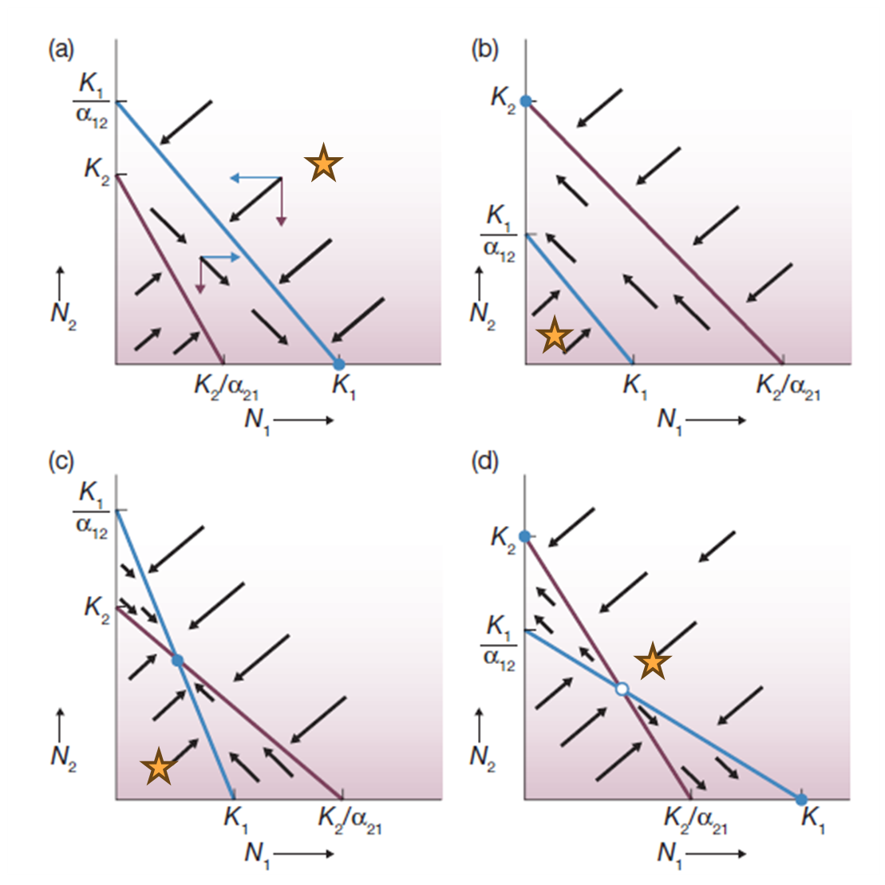

```{r setup, include=FALSE}
knitr::opts_chunk$set(echo = TRUE)
```

## Interspecific competition

Now that we understand how *intra*specific competition works its time to add a new competitor to the equation.

If we are talking about different species a the populations are different therefore populational parameters may be different between species.

Create one set of parameters for each species. The values should be as follows:

Intrinsic growth rate for species 1 = 0.4

Intrinsic growth rate for species 2 = 0.3

Carrying capacity for both species = 500

Initial number of individuals for species 1 = 50

Initial number of individuals for species 2 = 30

$\Delta t$ = 0.05

Span of time = from 0 to 50

```{r}
# intrinsic growth factors
growth_rate_1 <- 0.4
growth_rate_2 <- 0.3

# Carrying capacity
carry_cap <- 500

# Initial population sizes
init_pop_1 <- 50
init_pop_2 <- 30

# Time resolution
t_res <- 0.05

# Array of time units from t = 0 -> t = 50
t_vec <- seq(from=0, to=50, by=t_res)
```
We are aiming at a competition model, which essentially means that the growth speed of the populations affect one another. So we are also talking about $\frac{dN_1}{dt}$ and $\frac{dN_2}{dt}$. The following is the equation that explains the relationship for each one.

$\frac{dN_1}{dt} = r_1N_1 \frac{K_1-(N_1+N_2)}{K_1}$

$\frac{dN_2}{dt} = r_2N_2 \frac{K_2-(N_2+N_1)}{K_2}$

Using Euler's method to solve this equation we would have something like this:

$N_{1t+\Delta t} = N_{1t} + \Delta t \times r_1 N_{1t} \left(1 - \frac{N_{1t}+N_{2t}}{K_1}\right)$

$N_{2t+\Delta t} = N_{2t} + \Delta t \times r_2 N_{2t} \left(1 - \frac{N_{2t}+N_{1t}}{K_2}\right)$

Exactly how we run the numerical solution for one species using the `for()` loop function we should create for these two species. Remember that each population has a different set of N values through time.

```{r}
N <- function(dt, t, r1, r2, k1, k2, n0_1, n0_2) {
  
  # initialize vectors
  rows <- length(t)
  n1_vec <- rep(0, rows)
  n1_vec[1] <- n0_1
  n2_vec <- rep(0, rows)
  n2_vec[1] <- n0_2
  
  # calculate n1 and n2
  for (i in 2:rows) {
    n1_prev <- n1_vec[i-1]
    n2_prev <- n2_vec[i-1]
    n1_p_n2 <- n1_prev + n2_prev
    n1_vec[i] <- n1_prev + dt * r1 * n1_prev * (1 - n1_p_n2/k1)
    n2_vec[i] <- n2_prev + dt * r2 * n2_prev * (1 - n1_p_n2/k2)
  }
  
  # output as df
  df <- data.frame(Time = t, N1 = n1_vec, N2 = n2_vec)
  return(df)
}

```

If everthing went well you should now have vectors `N1` and `N2` with values for each split of time. Now let's plot this to visualize how the growth of one species affects the other one.

```{r}
# Exploration: Effect of changing parameters
par(mfrow = c(4, 4), mar = c(3, 3, 2, 1), oma = c(0, 0, 2, 0))  # Adjust margins
# 1. Baseline parameters
res1 <- N(t_res, t_vec, 0.4, 0.3, 500, 500, 50, 30)
plot(res1$Time, res1$N1, type = "l", col = "blue", ylim = c(0, 550),
  ylab = "Population", xlab = "Time", main = "Baseline")
lines(res1$Time, res1$N2, col = "red")

# 2. Equal growth rates
res2 <- N(t_res, t_vec, 0.4, 0.4, 500, 500, 50, 30)
plot(res2$Time, res2$N1, type = "l", col = "blue", ylim = c(0, 550),
  ylab = "Population", xlab = "Time", main = "Equal growth rates")
lines(res2$Time, res2$N2, col = "red")

# 3. Species 1 higher K
res3 <- N(t_res, t_vec, 0.4, 0.3, 600, 400, 50, 30)
plot(res3$Time, res3$N1, type = "l", col = "blue", ylim = c(0, 650),
  ylab = "Population", xlab = "Time", main = "Species 1 higher K")
lines(res3$Time, res3$N2, col = "red")

# 4. Unequal starting populations
res4 <- N(t_res, t_vec, 0.4, 0.3, 500, 500, 100, 10)
plot(res4$Time, res4$N1, type = "l", col = "blue", ylim = c(0, 550),
  ylab = "Population", xlab = "Time", main = "Unequal initial populations")
lines(res4$Time, res4$N2, col = "red")

# 5. Species 2 higher growth rate
res5 <- N(t_res, t_vec, 0.3, 0.5, 500, 500, 50, 30)
plot(res5$Time, res5$N1, type = "l", col = "blue", ylim = c(0, 550),
  ylab = "Population", xlab = "Time", main = "Species 2 faster growth")
lines(res5$Time, res5$N2, col = "red")

# 6. Equal growth and equal starts
res6 <- N(t_res, t_vec, 0.4, 0.4, 500, 500, 100, 100)
plot(res6$Time, res6$N1, type = "l", col = "blue", ylim = c(0, 550),
  ylab = "Population", xlab = "Time", main = "Equal growth and starts")
lines(res6$Time, res6$N2, col = "red")

# 7. Species 2 higher K
res7 <- N(t_res, t_vec, 0.4, 0.3, 200, 400, 50, 30)
plot(res7$Time, res7$N1, type = "l", col = "blue", ylim = c(0, 450),
  ylab = "Population", xlab = "Time", main = "Species 2 higher K")
lines(res7$Time, res7$N2, col = "red")

# 8. Species 2 much faster growth
res8 <- N(t_res, t_vec, 0.4, 1.2, 500, 500, 100, 10)
plot(res8$Time, res8$N1, type = "l", col = "blue", ylim = c(0, 550),
  ylab = "Population", xlab = "Time", main = "Species 2 rapid growth")
lines(res8$Time, res8$N2, col = "red")

# 9. Low growth rates
res9 <- N(t_res, t_vec, 0.1, 0.15, 500, 500, 50, 30)
plot(res9$Time, res9$N1, type = "l", col = "blue", ylim = c(0, 550),
  ylab = "Population", xlab = "Time", main = "Low growth rates")
lines(res9$Time, res9$N2, col = "red")

# 10. High growth rates
res10 <- N(t_res, t_vec, 0.8, 0.7, 500, 500, 50, 30)
plot(res10$Time, res10$N1, type = "l", col = "blue", ylim = c(0, 550),
  ylab = "Population", xlab = "Time", main = "High growth rates")
lines(res10$Time, res10$N2, col = "red")

# 11. Very different K values
res11 <- N(t_res, t_vec, 0.4, 0.3, 700, 300, 50, 30)
plot(res11$Time, res11$N1, type = "l", col = "blue", ylim = c(0, 750),
  ylab = "Population", xlab = "Time", main = "Large K difference")
lines(res11$Time, res11$N2, col = "red")

# 12. Reversed initial populations
res12 <- N(t_res, t_vec, 0.4, 0.3, 500, 500, 10, 100)
plot(res12$Time, res12$N1, type = "l", col = "blue", ylim = c(0, 550),
  ylab = "Population", xlab = "Time", main = "Species 2 starts larger")
lines(res12$Time, res12$N2, col = "red")

# 13. Moderate growth, high K
res13 <- N(t_res, t_vec, 0.35, 0.35, 700, 700, 50, 30)
plot(res13$Time, res13$N1, type = "l", col = "blue", ylim = c(0, 750),
  ylab = "Population", xlab = "Time", main = "High carrying capacity")
lines(res13$Time, res13$N2, col = "red")

# 14. Low K values
res14 <- N(t_res, t_vec, 0.4, 0.3, 200, 200, 50, 30)
plot(res14$Time, res14$N1, type = "l", col = "blue", ylim = c(0, 250),
  ylab = "Population", xlab = "Time", main = "Low carrying capacity")
lines(res14$Time, res14$N2, col = "red")

# 15. Extreme growth difference
res15 <- N(t_res, t_vec, 0.9, 0.2, 500, 500, 50, 30)
plot(res15$Time, res15$N1, type = "l", col = "blue", ylim = c(0, 550),
  ylab = "Population", xlab = "Time", main = "Extreme R difference")
lines(res15$Time, res15$N2, col = "red")

# 16. Legend plot (empty with just legend)
plot.new()
legend("center", legend = c("Species 1", "Species 2"), 
  col = c("blue", "red"), lty = 1, cex = 1.5, bty = "n")

par(mfrow = c(1, 1))  # Reset to single plot
```


### Asymentric interspecific competition

In nature species are not always competitively equivalents. Which essentially means that the impact of one individual of species A on the growth speed of species B, may be higher than the impact of one individual of species B on its own growth (read this carefully to be sure you understood).

A way to translate this mathematically is inserting a new parameter to the equation. This parameter is called *coefficient of competition* or $\alpha$. The new equation looks like this

$\frac{dN_1}{dt} = r_1N_1 \frac{K_1-(N_1+\alpha_{12}N_2)}{K_1}$

$\frac{dN_2}{dt} = r_2N_2 \frac{K_2-(N_2+\alpha_{21}N_1)}{K_2}$

The only difference from the equation above to the equations for symmetric competition is that we have a new parameter. Let's define this parameter as `alpha_12` (the effect of species 2 individuals on the growth speed of species 1) and `alpha_21` (the effect of species 1 individuals on the growth speed of species 2).

Define these new parameters below and run a numerical analysis considering these two new parameters.

```{r}
N_asym <- function(dt, t, r1, r2, k1, k2, n0_1, n0_2, alpha_1, alpha_2) {
  
  # initialize vectors
  rows <- length(t)
  n1_vec <- rep(0, rows)
  n1_vec[1] <- n0_1
  n2_vec <- rep(0, rows)
  n2_vec[1] <- n0_2
  
  # calculate n1 and n2
  for (i in 2:rows) {
    n1_prev <- n1_vec[i-1]
    n2_prev <- n2_vec[i-1]
    n1_vec[i] <- n1_prev + dt * r1 * n1_prev * ((k1 - (alpha_1 * n1_prev + n2_prev))/k1)
    n2_vec[i] <- n2_prev + dt * r2 * n2_prev * ((k2 - (n1_prev + alpha_2 * n2_prev))/k2)
  }
  
  # output as df
  df <- data.frame(Time = t, N1 = n1_vec, N2 = n2_vec)
  return(df)
}
```

## The assignment task.

The figure below is showing four relationships between the parameters in the models. Your task is to understand what each of these graphs is showing.

If the figure is not shown in this file, it is available on the Module on Quercus.

{width="475"}

The graphs are plotting N1 in the x axis and N2 in the y axis. Therefore any point in this graph is giving you a value for N1 and N2 relative to the other parameters k and $\alpha$.

Your task is to set the parameters as described in each graph. For example, in graph (a) $K_1$ is larger than $\frac{K_2}{\alpha_{12}}$ and $K_2$ is smaller than $\frac{K_1}{\alpha_{21}}$.

1.  Set the parameters in the model to match the conditions in graph (a). It doesn't matter the precise value provided that they match the relative relationship to one another.
2.  Change the initial value of both populations, run the model, and see what happens regarding *competitive exclusion.*
3.  Repeat number 2 again a few time and see how the result changes.
4.  Once you think what is happening change the set of parameters to match the conditions in graph (b) and repeat items 2 and 3.
5.  Repeat item 4 for graphs (c) and (d).

## Analysis

Let $k_1 = 400$ and $k_2 = 250$ be constant carrying capacities for species 1 and 2 respectively.

**Graph (a): Species 1 wins (competitive exclusion)**  
Condition: $K_1 > \frac{K_2}{\alpha_{21}}$ AND $\frac{K_1}{\alpha_{12}} > K_2$  
Parameters: $\alpha_{1a} = 0.5$, $\alpha_{2a} = 2$  
This gives: $\frac{K_1}{\alpha_{12}} = 800 > K_2$ and $\frac{K_2}{\alpha_{21}} = 125 < K_1$

**Graph (b): Species 2 wins (competitive exclusion)**  
Condition: $K_2 > \frac{K_1}{\alpha_{12}}$ AND $\frac{K_2}{\alpha_{21}} > K_1$  
Parameters: $\alpha_{1b} = 2$, $\alpha_{2b} = 0.5$  
This gives: $\frac{K_1}{\alpha_{12}} = 200 < K_2$ and $\frac{K_2}{\alpha_{21}} = 500 > K_1$

**Graph (c): Stable coexistence**  
Condition: $K_1 > \frac{K_2}{\alpha_{21}}$ AND $K_2 > \frac{K_1}{\alpha_{12}}$  
Parameters: $\alpha_{1c} = 2.5$, $\alpha_{2c} = 1.5$  
This gives: $\frac{K_1}{\alpha_{12}} = 160 < K_2$ and $\frac{K_2}{\alpha_{21}} = 167 < K_1$

**Graph (d): Unstable equilibrium**  
Condition: $\frac{K_1}{\alpha_{12}} > K_2$ AND $\frac{K_2}{\alpha_{21}} > K_1$  
Parameters: $\alpha_{1d} = 0.5$, $\alpha_{2d} = 0.5$  
This gives: $\frac{K_1}{\alpha_{12}} = 800 > K_2$ and $\frac{K_2}{\alpha_{21}} = 500 > K_1$


```{r}
# set carrying capacities
k1 <- 400
k2 <- 250

# set competitive exclusion parameters to match the four scenarios
# Scenario A: Species 1 wins (K1 > K2/α21 AND K1/α12 > K2)
alpha_1a <- 0.5
alpha_2a <- 2

# Scenario B: Species 2 wins (K2 > K1/α12 AND K2/α21 > K1)
alpha_1b <- 2
alpha_2b <- 0.5

# Scenario C: Stable coexistence (K1 > K2/α21 AND K2 > K1/α12)
alpha_1c <- 2.5
alpha_2c <- 1.5

# Scenario D: Unstable equilibrium (K1/α12 > K2 AND K2/α21 > K1)
alpha_1d <- 0.5
alpha_2d <- 0.5

# Set consistent axis limits
xlim <- c(0, max(k1, k2/alpha_2a, k2/alpha_2b, k2/alpha_2c, k2/alpha_2d) * 1.15)
ylim <- c(0, max(k2, k1/alpha_1a, k1/alpha_1b, k1/alpha_1c, k1/alpha_1d) * 1.15)

par(mfrow = c(2, 2), mar = c(5, 5, 3, 2), oma = c(0, 0, 2, 0))

# Scenario A - Species 1 wins
plot(c(k1, 0), c(0, k1/alpha_1a), type = "l", col = "blue", lwd = 2,
  xlim = xlim, ylim = ylim, xlab = "", ylab = "", main = "(a) Species 1 wins",
  xaxt = "n", yaxt = "n")
lines(c(0, k2/alpha_2a), c(k2, 0), col = "red", lwd = 2)
axis(1, at = c(k2/alpha_2a, k1), labels = c(expression(K[2]/alpha[21]), expression(K[1])), 
  las = 1, cex.axis = 0.9)
axis(2, at = c(k2, k1/alpha_1a), labels = c(expression(K[2]), expression(K[1]/alpha[12])), 
  las = 2, cex.axis = 0.9)
mtext(expression(N[1]), side = 1, line = 3, cex = 0.9)
mtext(expression(N[2]), side = 2, line = 3, cex = 0.9)
legend("topright", legend = c("Species 1", "Species 2"), col = c("blue", "red"), lwd = 2, cex = 0.8)

# Scenario B - Species 2 wins
plot(c(k1, 0), c(0, k1/alpha_1b), type = "l", col = "blue", lwd = 2,
  xlim = xlim, ylim = ylim, xlab = "", ylab = "", main = "(b) Species 2 wins",
  xaxt = "n", yaxt = "n")
lines(c(0, k2/alpha_2b), c(k2, 0), col = "red", lwd = 2)
axis(1, at = c(k1, k2/alpha_2b), labels = c(expression(K[1]), expression(K[2]/alpha[21])), 
  las = 1, cex.axis = 0.9)
axis(2, at = c(k1/alpha_1b, k2), labels = c(expression(K[1]/alpha[12]), expression(K[2])), 
  las = 2, cex.axis = 0.9)
mtext(expression(N[1]), side = 1, line = 3, cex = 0.9)
mtext(expression(N[2]), side = 2, line = 3, cex = 0.9)

# Scenario C - Stable coexistence
plot(c(k1, 0), c(0, k1/alpha_1c), type = "l", col = "blue", lwd = 2,
  xlim = xlim, ylim = ylim, xlab = "", ylab = "", main = "(c) Stable coexistence",
  xaxt = "n", yaxt = "n")
lines(c(0, k2/alpha_2c), c(k2, 0), col = "red", lwd = 2)
axis(1, at = c(k2/alpha_2c, k1), labels = c(expression(K[2]/alpha[21]), expression(K[1])), 
  las = 1, cex.axis = 0.9)
axis(2, at = c(k1/alpha_1c, k2), labels = c(expression(K[1]/alpha[12]), expression(K[2])), 
  las = 2, cex.axis = 0.9)
mtext(expression(N[1]), side = 1, line = 3, cex = 0.9)
mtext(expression(N[2]), side = 2, line = 3, cex = 0.9)

# Scenario D - Unstable equilibrium
plot(c(k1, 0), c(0, k1/alpha_1d), type = "l", col = "blue", lwd = 2,
  xlim = xlim, ylim = ylim, xlab = "", ylab = "", main = "(d) Unstable equilibrium",
  xaxt = "n", yaxt = "n")
lines(c(0, k2/alpha_2d), c(k2, 0), col = "red", lwd = 2)
axis(1, at = c(k1, k2/alpha_2d), labels = c(expression(K[1]), expression(K[2]/alpha[21])), 
  las = 1, cex.axis = 0.9)
axis(2, at = c(k2, k1/alpha_1d), labels = c(expression(K[2]), expression(K[1]/alpha[12])), 
  las = 2, cex.axis = 0.9)
mtext(expression(N[1]), side = 1, line = 3, cex = 0.9)
mtext(expression(N[2]), side = 2, line = 3, cex = 0.9)

mtext("Lotka-Volterra Competition Isoclines", outer = TRUE, cex = 1.2)
```

```{r}
dt <- 0.05
t <- seq(0, 50, by = dt)
r1 <- 0.5
r2 <- 0.5
n0_1 <- 50
n0_2 <- 50

# Carrying capacities
k1 <- 400
k2 <- 250

# Competition coefficients for each scenario
alpha_1a <- 0.5
alpha_2a <- 2

alpha_1b <- 2
alpha_2b <- 0.5

alpha_1c <- 2.5
alpha_2c <- 1.5

alpha_1d <- 0.5
alpha_2d <- 0.5

# Run simulations for each scenario
df_a <- N_asym(dt, t, r1, r2, k1, k2, n0_1, n0_2, alpha_1a, alpha_2a)
df_b <- N_asym(dt, t, r1, r2, k1, k2, n0_1, n0_2, alpha_1b, alpha_2b)
df_c <- N_asym(dt, t, r1, r2, k1, k2, n0_1, n0_2, alpha_1c, alpha_2c)
df_d <- N_asym(dt, t, r1, r2, k1, k2, n0_1, n0_2, alpha_1d, alpha_2d)

# Create 2x2 plot layout
par(mfrow = c(2, 2), mar = c(4, 4, 3, 2), oma = c(0, 0, 2, 0))

# Plot (a): Species 1 wins
plot(df_a$Time, df_a$N1, type = "l", col = "blue", lwd = 2, ylim = c(0, max(k1, k2)),
  xlab = "Time", ylab = "Population Size", main = "(a) Species 1 wins")
lines(df_a$Time, df_a$N2, col = "red", lwd = 2)
legend("right", legend = c("Species 1", "Species 2"), col = c("blue", "red"), 
  lwd = 2, cex = 0.8)

# Plot (b): Species 2 wins
plot(df_b$Time, df_b$N1, type = "l", col = "blue", lwd = 2, ylim = c(0, max(k1, k2)),
  xlab = "Time", ylab = "Population Size", main = "(b) Species 2 wins")
lines(df_b$Time, df_b$N2, col = "red", lwd = 2)
legend("right", legend = c("Species 1", "Species 2"), col = c("blue", "red"), 
  lwd = 2, cex = 0.8)

# Plot (c): Stable coexistence
plot(df_c$Time, df_c$N1, type = "l", col = "blue", lwd = 2, ylim = c(0, max(k1, k2)),
  xlab = "Time", ylab = "Population Size", main = "(c) Stable coexistence")
lines(df_c$Time, df_c$N2, col = "red", lwd = 2)
legend("right", legend = c("Species 1", "Species 2"), col = c("blue", "red"), 
  lwd = 2, cex = 0.8)

# Plot (d): Unstable equilibrium
plot(df_d$Time, df_d$N1, type = "l", col = "blue", lwd = 2, ylim = c(0, max(k1, k2)),
  xlab = "Time", ylab = "Population Size", main = "(d) Unstable equilibrium")
lines(df_d$Time, df_d$N2, col = "red", lwd = 2)
legend("right", legend = c("Species 1", "Species 2"), col = c("blue", "red"), 
  lwd = 2, cex = 0.8)

mtext("Lotka-Volterra Competition Dynamics Over Time", outer = TRUE, cex = 1.2)
```